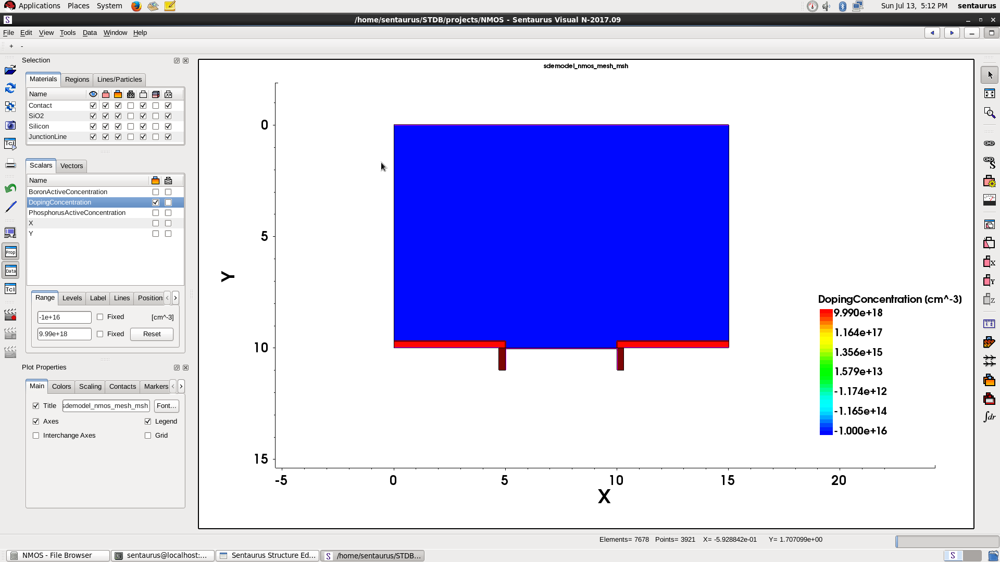
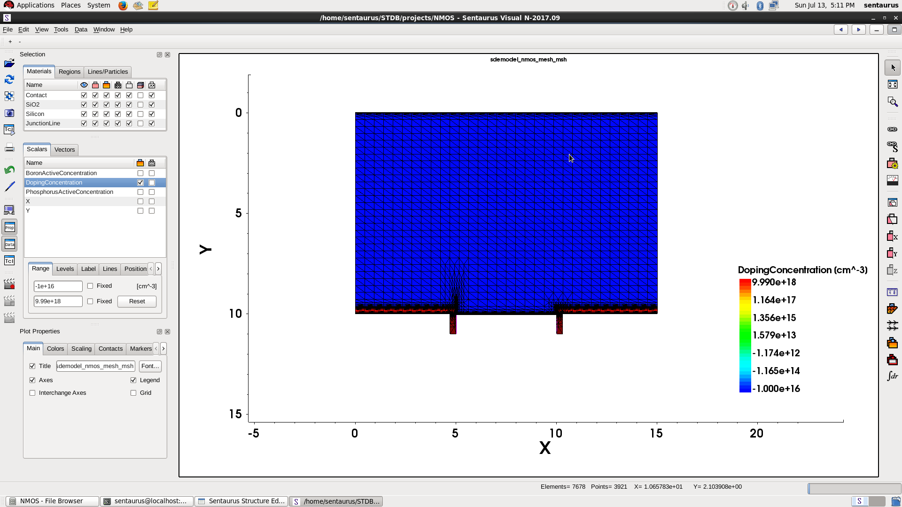
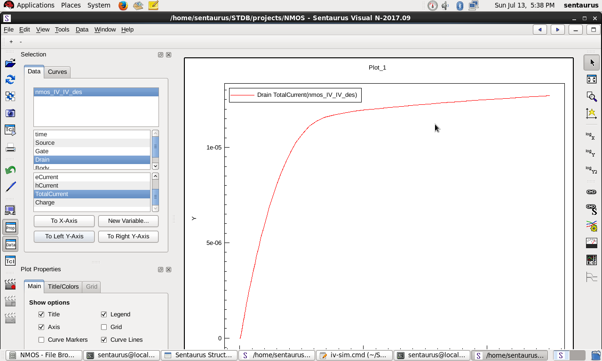
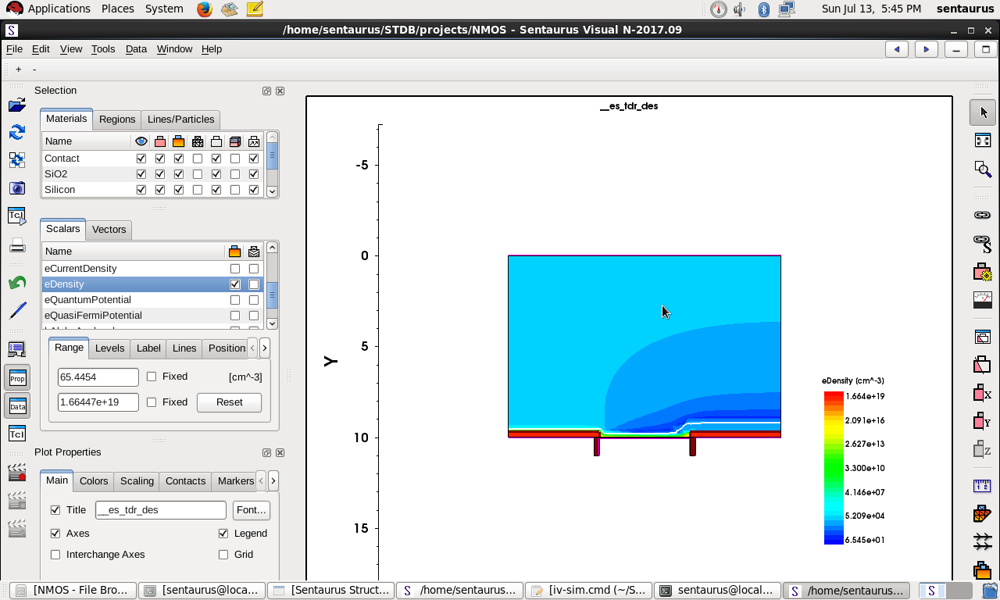
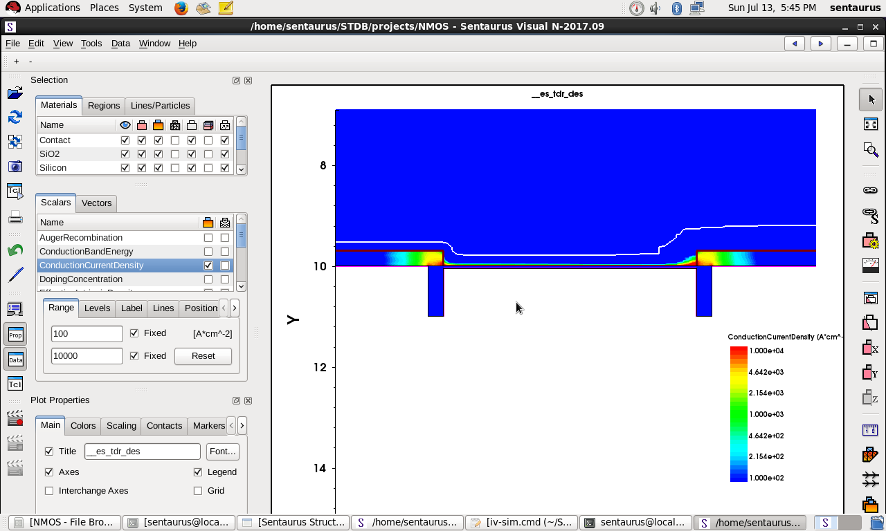
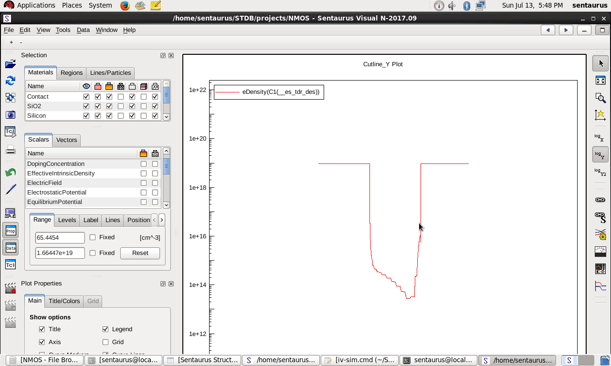
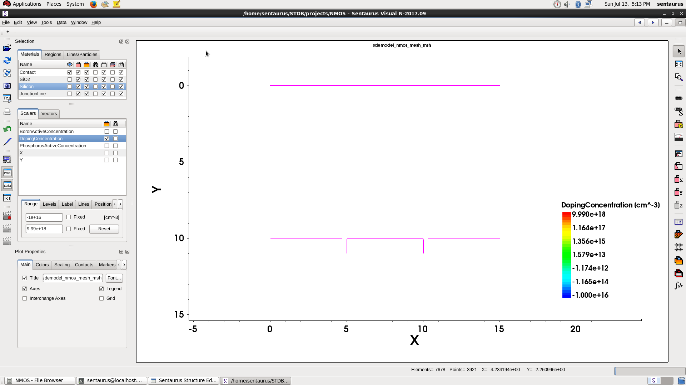

# **TCAD – NMOS Setup and Simulation**

This document outlines the complete process to model, mesh, and prepare an **n-channel MOSFET (NMOS)** structure using Synopsys Sentaurus TCAD tools. The explanation assumes a GUI-driven approach for structure design, with a scripted simulation using a `.cmd` file, and this guide ends at the point just before simulation.

---

### **Structure Drawing (Geometry Setup)**

* Open the **Draw** module.

* Disable **Auto Region Naming**. This ensures that region labels are controlled manually instead of being auto-generated by the tool.

* Enable **Exact Coordinates** so that drawing operations snap precisely to user-defined coordinate inputs.

* Switch to **XY View** via the lens icon to enter 2D drawing mode, locking into top-down view.

* Use the **Rectangle Tool** to draw the base silicon substrate:

  * `x1 = 0`, `y1 = 0`
  * `x2 = 15`, `y2 = 10`

  This creates a 15 μm wide, 10 μm high rectangle that represents the **p-type silicon substrate**.

* Use the **Fit to View** option to ensure the entire structure is visible.

---

### **Doping Profile Assignment**

#### Substrate (P-type Body)

* Navigate to **Device > Constant Profile Placement**.
* Select **Region** as the placement method and choose the silicon substrate region.
* Choose **BoronActiveConcentration** and set the value to `1e+16 cm⁻³`.

This applies uniform **p-type doping** to the entire substrate. Boron is a standard acceptor dopant in silicon, and this concentration level sets up the body for an enhancement-mode NMOS.

#### Source and Drain (N+ Regions)

* Again use **Device > Constant Profile Placement**, but this time use the **Rectangle** method instead of selecting a region.

* Draw two rectangular placement windows for the source and drain regions:

  * **Source**:

    * Top-left corner: `(0, 10)`
    * Bottom-right corner: `(5, 9.7)`
    * Doping: `PhosphorusActiveConcentration = 1e+19`

  * **Drain**:

    * Top-left corner: `(10, 10)`
    * Bottom-right corner: `(15, 9.7)`
    * Doping: `PhosphorusActiveConcentration = 1e+19`

These define highly doped **n+ source and drain regions**, typical for NMOS transistors. The very high doping ensures low contact resistance and high conductivity.

#### Gate and Oxide Stack

* Draw a new **oxide (SiO₂)** rectangle above the channel:

  * Example coordinates: `(5, 10)` to `(10, 10.2)`
  * This thin vertical gap represents the **gate oxide**.

* Then, draw a **polysilicon gate** on top:

  * Coordinates: `(5, 10.2)` to `(10, 11)`
  * This represents the **poly gate** electrode sitting above the channel.

This stacked gate configuration defines the vertical MOS capacitor necessary for forming the inversion layer (channel) in NMOS operation.

---

### **Contact Definition and Assignment**

* Go to **Contact > Contact Sets**.

* Define four contact names with their respective color codes:

  * `Source` – `100` (Red)
  * `Drain` – `010` (Green or Blue)
  * `Gate` – `001` (Typically Blue or Purple)
  * `Body` – `110` (Yellow or custom)

* Click **Set** after defining each contact to register them in the project.

* Activate the **Cursor Tool** from the toolbar.

* Switch the **Select Body** dropdown to **Select Edge**.

* Assign contacts to edges as follows:

  * Left vertical edge of the **source region**: assign `Source`
  * Right vertical edge of the **drain region**: assign `Drain`
  * Top edge of the **polysilicon gate**: assign `Gate`
  * Bottom edge of the **substrate**: assign `Body`

This ensures proper terminal definitions for NMOS operation: drain-to-source conduction and gate-to-body control.

---

### **Meshing the Structure**

#### Defining the Refinement Area

* Go to **Mesh > Define Rel/Eval Window > Rectangle**.
* Draw a rectangle that fully encloses the entire NMOS structure.
  This becomes the global mesh refinement window. Exact coordinates are not critical as long as the device is fully covered.

#### Mesh Refinement Placement

* Navigate to **Mesh > Refinement Placement** and choose **Mesh in Rel/Eval Window**.

* Set the following values:

  * `Min Element Size x`: `0.001 μm`
  * `Min Element Size y`: `0.001 μm`
  * `Max Element Size x`: `0.5 μm`
  * `Max Element Size y`: `0.5 μm`

These values ensure a fine mesh in critical device regions (such as the channel and junctions), while still allowing for larger elements in non-critical bulk areas.

* Open **More Options >>** and add multiple interface-based refinements:

  * **MaxGradient**:

    * `Variable = DopingConcentration`
    * `Value = 1`

    This applies mesh refinement wherever there’s a sharp doping gradient, such as source–body and drain–body junctions.

  * **MaxLenInt (Interface Length)**:

    * **Material Interfaces**: `Silicon–SiO₂` and `Silicon–Contact`
    * **Length**: `0.001`
    * **Factor**: `2`
    * **DoubleSide**: Enabled

This type of refinement enforces denser meshing near material boundaries. The **factor** controls how quickly mesh elements expand in size as they move away from the interface. A factor of `2` means the mesh grows geometrically (doubling in size per step), balancing detail and computational load. The **DoubleSide** option ensures refinement on both sides of the interface.

* Click **Add and Place** to apply the refinement rules.

#### Building the Mesh

* Go to **Mesh > Build Mesh**.
* The generated mesh will open automatically in **SVisual**, allowing for visual inspection before simulation.

---

### **Pre-Simulation Structure and Mesh Setup File**

Below is the generated `.tdr` fragment defining the doping profiles, mesh refinement, and placement windows. This file can be re-imported to reconstruct the mesh or serve as a starting point for simulation scripting.

```txt
Title ""

Controls {
}

IOControls {
	outputFile = "sdemodel_nmos_mesh"
	EnableSections
}

Definitions {
	Constant "ConstantProfileDefinition_sub" {
		Species = "BoronActiveConcentration"
		Value = 1e+16
	}
	Constant "ConstantProfileDefinition_ns" {
		Species = "PhosphorusActiveConcentration"
		Value = 1e+19
	}
	Constant "ConstantProfileDefinition_nd" {
		Species = "PhosphorusActiveConcentration"
		Value = 1e+19
	}
	Refinement "RefinementDefinition_mesh" {
		MaxElementSize = ( 0.5 0.5 )
		MinElementSize = ( 0.001 0.001 )
		RefineFunction = MaxGradient(Variable = "DopingConcentration", Value = 1)
		RefineFunction = MaxLenInt(Interface("Silicon", "SiO2"), Value = 0.001, factor = 2, DoubleSide)
		RefineFunction = MaxLenInt(Interface("Silicon", "Contact"), Value = 0.001, factor = 2, DoubleSide)
	}
}

Placements {
	Constant "ConstantProfilePlacement_sub" {
		Reference = "ConstantProfileDefinition_sub"
		EvaluateWindow {
			Element = region ["region_substrate"]
		}
	}
	Constant "ConstantProfilePlacement_ns" {
		Reference = "ConstantProfileDefinition_ns"
		EvaluateWindow {
			Element = Rectangle [(0 10) (5 9.7)]
		}
	}
	Constant "ConstantProfilePlacement_nd" {
		Reference = "ConstantProfileDefinition_nd"
		EvaluateWindow {
			Element = Rectangle [(10 10) (15 9.7)]
		}
	}
	Refinement "RefinementPlacement_mesh" {
		Reference = "RefinementDefinition_mesh"
		RefineWindow = Rectangle [(-1.5346 11.8995) (16.5315 -1.778)]
	}
}
```

---

### **Tips for Extension**

* You can define gate workfunction, oxide thickness, and material-specific properties in the structure or simulation files for more accurate behavior.
* Time-dependent biasing and transient analysis can be introduced using additional commands in the `.cmd` file.
* Consider adding temperature-dependent models, mobility degradation, or interface charge in later versions.
* Use **probes** and **log files** to extract IV curves, threshold voltage, transconductance, and other transistor characteristics.


## **Script**

---

### **File Block**

```txt
File {
    Grid="sdemodel_nmos_mesh_msh.tdr"
    Current="@IV"
    Plot="@@es_tdr"
    Output="@@log@@"
}
```

This block defines all file-related inputs and outputs:

* `Grid` points to the mesh file created using `Sentaurus Structure Editor (sde)`. It contains the geometry, doping, materials, and mesh (`.tdr` format).
* `Current` logs the output IV data (automatically named via `@IV`).
* `Plot` contains the full dataset of physical parameters (for use in **SVisual**).
* `Output` captures simulation log messages and solver output — useful for diagnostics and convergence checks.

---

### **Electrode Block**

```txt
Electrode {
    { Name="Body"   Voltage=0.0 }
    { Name="Source" Voltage=0.0 }
    { Name="Drain"  Voltage=0.0 }
    { Name="Gate"   Voltage=0.0 workfunction=4.2 }
}
```

Defines the terminals of the NMOS device:

* `Body`, `Source`, and `Drain` are all initially grounded.
* `Gate` is also at 0 V initially but is assigned a **workfunction of 4.2 eV**, representative of **polysilicon gate material** (mid-gap for NMOS).

These names must match the contact labels defined during the meshing phase in SDE.

---

### **Physics Block**

```txt
Physics {
    EffectiveIntrinsicDensity(OldSlotboom)
    Fermi
    eQuantumPotential
    Mobility(
        DopingDependence
        CarrierCarrierScattering
        HighFieldSaturation(GradQuasiFermi)
        HighFieldSaturation(GradQuasiFermi)
        Enormal
    )
    Recombination(
        SRH(DopingDep)
        Auger
    )
}
```

Models the core semiconductor physics:

* `EffectiveIntrinsicDensity(OldSlotboom)` — accounts for **bandgap narrowing** due to heavy doping (important near source/drain).
* `Fermi` — enables **Fermi-Dirac statistics**, more accurate than Boltzmann approximation at high doping.
* `eQuantumPotential` — adds quantum confinement effects, modeling energy quantization in thin channels (used for nanoscale MOSFETs).

#### Mobility Models:

* `DopingDependence` — carrier mobility is reduced in heavily doped regions.
* `CarrierCarrierScattering` — includes carrier–carrier interactions in mobility degradation.
* `HighFieldSaturation(GradQuasiFermi)` — models velocity saturation at high electric fields.
* `Enormal` — accounts for perpendicular field effect on mobility in the inversion layer.

#### Recombination:

* `SRH(DopingDep)` — Shockley–Read–Hall recombination with doping dependency.
* `Auger` — Auger recombination, important at high carrier concentrations (like in S/D junctions).

---

### **Plot Block**

```txt
Plot {
    eCurrent hCurrent AvalancheGeneration ConductionCurrent
    eAlphaAvalanche hAlphaAvalanche AugerRecombination
    EquilibriumPotential IntrinsicDensity
    EffectiveIntrinsicDensity Temperature ElectricField Potential Doping
    SpaceCharge
    eBarrierTunneling hBarrierTunneling
    conductionbandenergy valancebandenergy
}
```

This block specifies all **quantities to be saved** during the simulation for visualization and analysis:

* **Currents**: electron (`eCurrent`), hole (`hCurrent`), total (`ConductionCurrent`)
* **Recombination**: Auger and Avalanche mechanisms
* **Fields and potentials**: electric field, potential, equilibrium potential
* **Material properties**: doping, intrinsic density, effective band edges
* **Energy bands**: conduction and valence band energies
* **Quantum effects**: barrier tunneling terms
* These can be viewed in **SVisual** to understand device behavior like channel formation, depletion, inversion, and conduction.

---

### **Math Block**

```txt
Math {
    Number_of_Threads = 4
    Iterations = 10
    NotDamped = 20
    RHSMIN = 1e-8
    Derivatives
    AvalDerivatives
    ErrRef(Electron) = 1e10
    ErrRef(Hole) = 1e10
    method = pardiso
    transient=BE
    -CheckUndefinedModels
}
```

This block defines **numerical solver settings**:

* `Number_of_Threads = 4` — use 4 CPU threads (parallel simulation).
* `Iterations`, `NotDamped`, `RHSMIN` — standard convergence tuning for Newton iterations.
* `Derivatives` and `AvalDerivatives` — automatic Jacobian computation.
* `ErrRef(...)` values are set high to reduce error sensitivity during convergence.
* `method = pardiso` — efficient sparse linear solver.
* `transient = BE` — backward Euler scheme (useful if transient mode is later enabled).
* `-CheckUndefinedModels` suppresses unnecessary warnings.

---

### **Solve Block**

This block carries out the **actual simulation**, in two main stages:

---

#### **Initialization and Gate Sweep**

```txt
Solve {
    Poisson
    Coupled (iterations=50) {Poisson Electron}
    Coupled (iterations=50) {Poisson Hole}
    Coupled (iterations=50) {Poisson Electron Hole}

    Plot (FilePrefix="nmos_initial")

    Quasistationary (
        InitialStep=0.1 Minstep=1e-5 MaxStep=0.1 Increment=1.3
        Goal {Name="Gate" Voltage=2.5}
    )
    {
        Coupled {Poisson Electron Hole}
    }

    Plot (FilePrefix="nmos")
    NewCurrentFile="nmos_IV"
```

* **Initial Solves**: Poisson-only and then full carrier transport solves to get a stable solution.
* `Plot (FilePrefix="nmos_initial")` — saves an initial snapshot.

##### **Gate Sweep**:

* Sweeps **Gate voltage** from 0 V to **2.5 V**, simulating **channel formation (inversion layer)**.
* `InitialStep`, `Minstep`, `MaxStep`, and `Increment` control adaptive step size in the sweep.

---

#### **Drain Sweep at Fixed Gate Bias**

```txt
    Quasistationary (
        DoZero
        InitialStep=0.001 Minstep=1e-5 MaxStep=0.1 Increment=1.3
        Goal {Name="Drain" Voltage=5}
    )
    {
        Coupled {Poisson Electron Hole}
    }
}
```

##### **Drain Sweep**:

* `DoZero` resets voltages before this step (clean drain sweep).
* Sweeps **Drain voltage from 0 V to 5 V**, at the previously set **Gate bias of 2.5 V**.
* This simulates **output characteristics (ID–VD)** at fixed `V_GS = 2.5 V`.
* Results are stored in `nmos_IV` and can be plotted to extract transfer/output characteristics.


<br><br><br>

# RESULTS

<h2 align="center">NMOS Structure</h2>

<p align="center">
  
</p>

<h2 align="center">NMOS Mesh</h2>

<p align="center">
  
</p>

<h2 align="center">IV Characteristics</h2>

<p align="center">
  
</p>

<h2 align="center">Electron Density</h2>

<p align="center">
  
</p>

<h2 align="center">Electron Density — Range: 100 to 10k</h2>

<p align="center">
  
</p>

<h2 align="center">Electron Density Cutline (Y-axis)</h2>

<p align="center">
  
</p>

<h2 align="center">Contacts</h2>

<p align="center">
  
</p>
