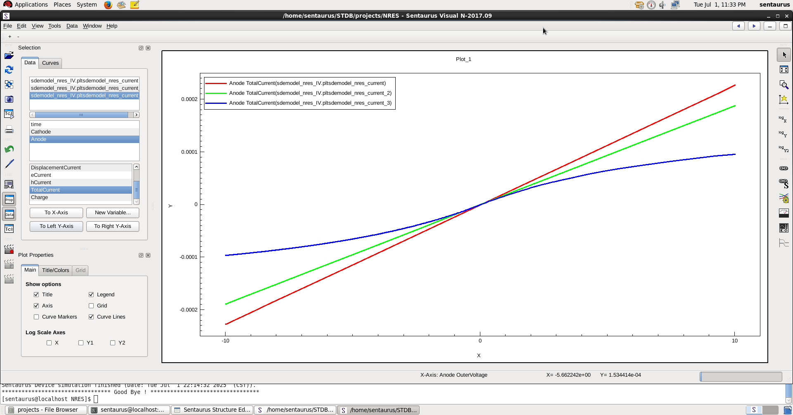
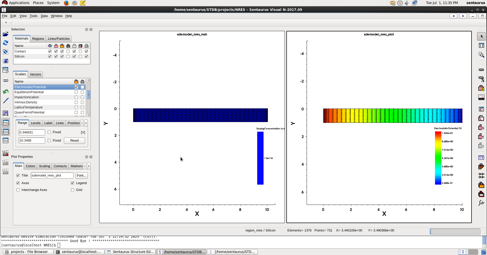
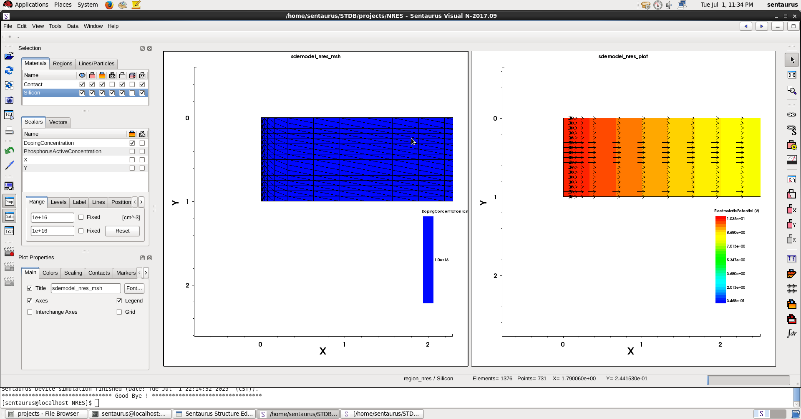

# **TCAD – N-Type Resistor Setup and Simulation**

This document outlines the complete process to model, mesh, and simulate an **n-type silicon resistor** using Synopsys Sentaurus TCAD tools. The explanation assumes usage of the GUI for structure building, followed by command-line simulation execution using a `.cmd` script.

---

### **Structure Drawing (Geometry Setup)**

* Open the **Draw** module.

* Disable **Auto Region Naming**. This gives you control over how regions are named instead of letting the tool auto-generate labels.

* Enable **Exact Coordinates**. This ensures that when you enter coordinate values, the tool will snap exactly to those points rather than approximate.

* Switch to **XY View** using the lens icon, which simplifies drawing in 2D by locking into the top-down view.

* Select the **Rectangle Tool**.

* Enter:

  * `x1 = 0`, `y1 = 0`
  * `x2 = 10`, `y2 = 1`

  This creates a rectangular slab of silicon measuring 10μm in width and 1μm in height. The shape represents the physical layout of a resistor.

* Use the **Fit to View** option (lens icon) to see the entire drawn structure.

---

### **Doping Profile Assignment**

* Navigate to **Device > Constant Profile Placement**.
* Choose **Region** as the placement method and select the drawn rectangle.
* For doping:

  * Select **PhosphorousActiveConcentration**.
  * Enter a concentration of `1e+16 cm⁻³`.

This applies uniform n-type doping using phosphorous, a standard donor in silicon. The moderate doping level is suitable for a linear resistor behavior with reasonable resistance.

---

### **Contact Definition and Assignment**

* Go to **Contact > Contact Sets**.

* Define two contacts:

  * Name: `Anode` with code `100` (typically shown in red)
  * Name: `Cathode` with code `001` (typically blue)

* Click **Set** after naming each one to register them.

* Activate the **Cursor Tool** from the left toolbar to enter selection mode.

* Change the **Select Body** dropdown to **Select Edge**.

* Click on one vertical edge of the rectangle (for instance, the left edge), then select `Anode` from the contact dropdown and assign it.

* Repeat for the opposite edge (e.g. right edge), assigning it as `Cathode`.

This setup ensures current will flow laterally from one side to the other during simulation, just like in a real resistor.

---

### **Meshing the Structure**

#### Defining the Meshing Area

* Go to **Mesh > Define Rel/Eval Window > Rectangle**.
* Draw a rectangle that completely encompasses the silicon region.
  The exact dimensions aren’t critical, as long as the drawn device is fully enclosed. This rectangle defines the boundary within which mesh refinement settings will be applied.

#### Mesh Refinement Placement

* Go to **Mesh > Refinement Placement** and choose **Mesh in Rel/Eval Window**.

* Set minimum and maximum element sizes:

  * `Min element size x`: `0.5` (nm)
  * `Max element size x`: `0.01` (nm)
  * `Min and Max element size y`: `0.1` (nm)

This configures how fine the mesh is in the horizontal (x) and vertical (y) directions. A smaller mesh size along x is chosen due to expected variation in potential and carrier concentration along the resistor's length.

* Click **More Options >>** to open additional meshing parameters.

* Select **Interface Length** refinement.

  * Choose both `Silicon` and `Contact` as interface materials.
  * Set **Length** to `0.01` (same as the minimum mesh size).
  * Set **Factor** to `2`.

This introduces gradient-based mesh refinement near material interfaces. The factor controls how the mesh spacing increases as you move away from the interface. For instance, a factor of 2 means each mesh element moving away from the interface will be twice as large as the previous one, gradually coarsening the mesh. This provides higher resolution where needed (interfaces, contact regions) while keeping the total element count reasonable by using coarser mesh in bulk regions.

* Click **Add and Place** to apply the refinement.

#### Building the Mesh

* Go to **Mesh > Build Mesh**.
* The generated mesh will automatically open in **SVisual**, allowing you to inspect it visually.

---

### **Simulation Execution**

#### Using Command Line Tools

To simulate the device and visualize the output, use the following command-line tools in order:

```bash
sde                 # Opens the Structure Editor (if needed)
svisual             # Opens the structure and mesh viewer
sdevice filename.cmd  # Runs simulation based on your script file
```

* The `.cmd` file should include physics models, boundary conditions, and biasing conditions required for the simulation.
* The results can then be visualized in **SVisual**, allowing you to inspect voltage drops, current densities, carrier concentrations, and other device parameters.

---
### **Pre-Simulation Structure and Mesh Setup File**

This section shows the configuration snapshot that defines the structure, doping, and meshing just before running the simulation. It includes region-based doping assignments and mesh refinement windows.

This is the `.cmd` or `.tdr` setup fragment generated by the TCAD tool after the drawing and meshing steps have been completed. It helps verify that the correct profile, region, and mesh refinement were assigned as expected before launching the device simulation.

Use this section for reference or future re-import into the tool to reproduce or edit the structure visually without repeating the entire manual draw/assign process.

```txt
Title ""

Controls {
}

IOControls {
	outputFile = "sdemodel_nres"
	EnableSections
}

Definitions {
	Constant "ConstantProfileDefinition_nres" {
		Species = "PhosphorusActiveConcentration"
		Value = 1e+16
	}
	Refinement "RefinementDefinition_nres_mesh" {
		MaxElementSize = ( 0.5 0.1 )
		MinElementSize = ( 0.01 0.1 )
		RefineFunction = MaxLenInt(Interface("Silicon","Contact"), Value=0.01, factor=2)
	}
}

Placements {
	Constant "ConstantProfilePlacement_nres" {
		Reference = "ConstantProfileDefinition_nres"
		EvaluateWindow {
			Element = region ["region_nres"]
		}
	}
	Refinement "RefinementPlacement_nres_mesh" {
		Reference = "RefinementDefinition_nres_mesh"
		RefineWindow = Rectangle [(-0.4537 1.3965) (10.4715 -0.4085)]
	}
}
```
---

### **Tips for Extension**

* You can script the structure and mesh creation using `.tdr` or `.tcl` files for automation.
* Consider defining output probes or log files in your `.cmd` file for current, voltage, and resistance measurement.
* You can also include temperature dependence, advanced mobility models, or transient simulations as next steps.

---

## **Script**

### **File Block**

```txt
File {
    Grid = "sdemodel_nres_msh.tdr"
    Current = "sdemodel_nres_current.plt"
    Plot = "sdemodel_nres_plot.tdr"
    Output = "sdemodel_nres_output.log"
}
```

This block defines file I/O used during the simulation:

* `Grid` specifies the mesh file generated earlier (`.tdr` format), which contains the device structure and grid data.
* `Current` is where the current vs. voltage data is logged (useful for extracting IV curves).
* `Plot` specifies the file where detailed device simulation results are stored (e.g., potential, carrier concentrations).
* `Output` is the standard log file that records all messages, warnings, and convergence information from the simulation.

---

### **Electrode Block**

```txt
Electrode {
    { Name = "Anode" Voltage = 0.0 }
    { Name = "Cathode" Voltage = 0.0 }
}
```

This defines the initial bias condition on both terminals:

* Both `Anode` and `Cathode` are initially set to `0.0 V`.
* Bias will later be applied using `Quasistationary` sweeps (defined in the `Solve` block), so this just sets the initial state.

---

### **Physics Block**

```txt
Physics {
    Mobility (
       DopingDependence
       HighFieldSaturation
    )
    Recombination (SRH)
    EffectiveIntrinsicDensity (
        BandGapNarrowing (oldSlotboom)
    )
    Fermi
}
```

This block defines the physical models used in the simulation:

* `Mobility` includes:

  * `DopingDependence`: Electron and hole mobility change based on local doping.
  * `HighFieldSaturation`: Limits mobility under high electric fields to reflect velocity saturation.
* `Recombination (SRH)` uses Shockley–Read–Hall model to model carrier recombination through traps.
* `EffectiveIntrinsicDensity` with `BandGapNarrowing (oldSlotboom)` adjusts the intrinsic carrier density to account for doping-induced bandgap narrowing.
* `Fermi` enables the use of full Fermi–Dirac statistics instead of the simpler Boltzmann approximation, improving accuracy in heavily doped regions.

---

### **Plot Block**

```txt
Plot {
    eCurrent/Vector
    hCurrent
    AvalancheGeneration
    ConductionCurrent/Vector
    eAlphaAvalanche
    hAlphaAvalanche
    AugerRecombination
    EquilibriumPotential
    IntrinsicDensity
    EffectiveIntrinsicDensity
    Temperature
    ElectricField
    Potential
    Doping
    SpaceCharge
    eBarrierTunneling
    hBarrierTunneling
    conductionBandEnergy
    valenceBandEnergy
}
```

This block specifies which quantities will be saved for post-processing:

* Includes carrier currents, electric fields, potentials, energy band diagrams, recombination data, etc.
* Useful for visualizing internal physical behavior in **SVisual**.
* The `/Vector` options (e.g., `eCurrent/Vector`) will store both magnitude and direction of vectors.

---

### **Math Block**

```txt
Math {
    Number_of_Threads = 4
    Iterations = 10
    NotDamped = 20
    RHSMin = 1e-8
    Derivatives
    AvalDerivatives
    ErrRef(Electron) = 1e10
    ErrRef(Hole) = 1e10
    method = pardiso
    transient = BE
    -CheckUndefinedModels
}
```

This section sets the numerical solving parameters:

* `Number_of_Threads = 4`: Enables multithreading for faster simulations.
* `Iterations = 10`: Max number of Newton-Raphson iterations per solve step.
* `NotDamped = 20`: Allows some initial iterations without damping to accelerate convergence.
* `RHSMin = 1e-8`: Right-hand-side convergence criterion; smaller means tighter convergence.
* `Derivatives` and `AvalDerivatives` enable automatic Jacobian derivatives, improving convergence in nonlinear solves.
* `ErrRef(...)`: High error reference values to de-emphasize local error-based step control (could be used to avoid over-sensitivity).
* `method = pardiso`: Uses Intel's PARDISO solver for faster matrix factorization and solution.
* `transient = BE`: Sets the time integration scheme to Backward Euler (for future transient simulations; not active here).
* `-CheckUndefinedModels`: Suppresses warnings if some models aren’t defined, avoiding simulation stop due to missing optional entries.

---

### **Solve Block**

```txt
Solve {
    Poisson

    Coupled (iterations = 50) { Poisson Electron }
    Coupled (iterations = 50) { Poisson Hole }
    Coupled (iterations = 50) { Poisson Electron Hole }

    Plot (FilePrefix = "sdemodel_nres_initial")
```

Starts by solving:

* `Poisson`: Static electric potential solution (initial guess for full solve).
* Then proceeds with **coupled solves** for carrier transport:

  * One for `Electron` only
  * One for `Hole` only
  * One for both together, allowing mutual interaction
* This builds up the charge solution in stages, stabilizing the nonlinear system.
* Plots the result of the initial setup under equilibrium (`sdemodel_nres_initial_*` files).

---

#### **First Bias Sweep (Negative)**

```txt
    Quasistationary (
        InitialStep = 1e-3
        MinStep = 1e-7
        MaxStep = 0.1
        Increment = 2
        Goal { Name = "Anode" Voltage = -10 }
    )
    {
        Coupled { Poisson Electron Hole }
    }
```

Performs a quasistatic voltage sweep on the `Anode` contact:

* Starts from 0V (default) and steps toward `-10V`.
* Adaptive stepping with:

  * Initial step: `1e-3 V`
  * Min step: `1e-7 V`
  * Max step: `0.1 V`
  * Step size increases by a factor of 2 when convergence is good (`Increment = 2`)
* In each step, solves for coupled `Poisson + Electron + Hole` equations.

---

#### **Post-Sweep Plot and Output**

```txt
    Plot (FilePrefix = "sdemodel_nres_VA_m3")
    NewCurrentFile = "sdemodel_nres_IV.plt"
```

* Stores simulation results after the first sweep under new plot prefix.
* Starts a new current plot file to separate the IV data for the next sweep.

---

#### **Second Bias Sweep (Positive)**

```txt
    Quasistationary (
        InitialStep = 1e-3
        MinStep = 1e-7
        MaxStep = 0.1
        Increment = 2
        Goal { Name = "Anode" Voltage = 10 }
    )
    {
        Coupled { Poisson Electron Hole }
    }
}
```

Performs a second sweep from the last bias (−10V) up to `+10V` on the `Anode`. All the solver settings remain the same.

This full sweep from −10V to +10V simulates the **full IV behavior** of the resistor, giving insight into its linearity and resistance.

<br><br><br>

# RESULTS

<h2 align="center">I–V Characteristics (All Modes)</h2>

<p align="center">
  
</p>

<p align="center">
  <em>IV plot showing all three simulation modes:<br>
  • No physics<br>
  • With doping dependency<br>
  • With doping dependency and velocity saturation</em>
</p>

<h2 align="center">Electric Potential Distribution</h2>

<p align="center">
  
</p>

<p align="center">
  <em>Mesh showing electric potential variation across the device</em>
</p>

<h2 align="center">Electric Potential – Zoomed with Field Directions</h2>

<p align="center">
  
</p>

<p align="center">
  <em>Zoomed-in view highlighting potential gradients and field directions</em>
</p>
